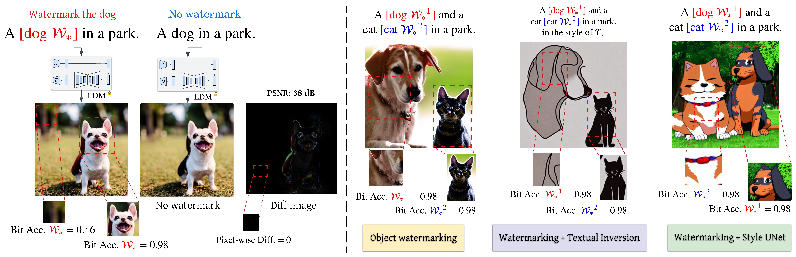
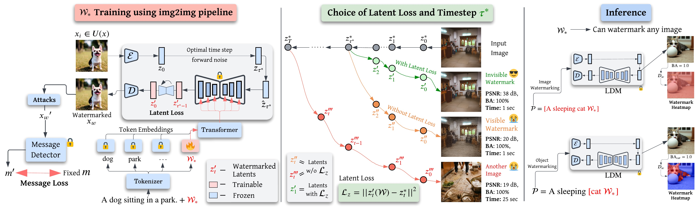
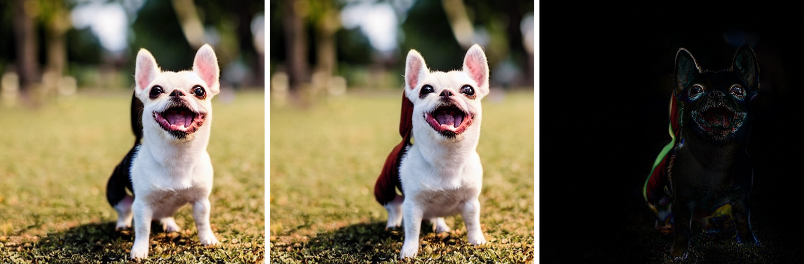
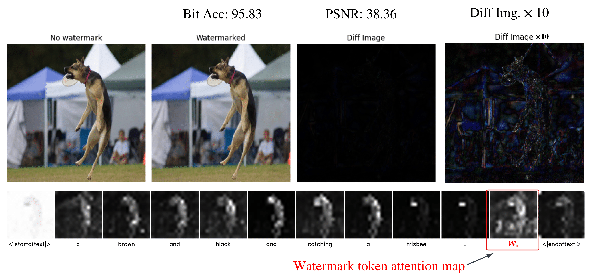

# [ICCV 2025] Your Text Encoder Can Be An Object-Level Watermarking Controller

<p align="center">
  <strong>Naresh Kumar Devulapally</strong>¹ &middot; 
  <strong>Mingzhen Huang</strong>¹ &middot; 
  <strong>Vishal Asnani</strong>² &middot; 
  <strong>Shruti Agarwal</strong>² &middot; 
  <strong>Siwei Lyu</strong>¹ &middot; 
  <strong>Vishnu Suresh Lokhande</strong>¹
</p>

<p align="center">
  ¹ University at Buffalo, SUNY &bull; ² Adobe Research
</p>

## Abstract

Invisible watermarking of AI-generated images can help with copyright protection, enabling detection and identification of AI-generated media. In this work, we present a novel approach to watermark images of T2I Latent Diffusion Models (LDMs). By only fine-tuning text token embeddings $\mathcal{W}_*$, we enable watermarking in selected objects or parts of the image, offering greater flexibility compared to traditional full-image watermarking. Our method leverages the text encoder’s compatibility across various LDMs, allowing plug-and-play integration for different LDMs. Moreover, introducing the watermark early in the encoding stage improves robustness to adversarial perturbations in later stages of the pipeline. Our approach achieves $99\%$ bit accuracy ($48$ bits) with a $10^5 \times$ reduction in model parameters, enabling efficient watermarking.

## Installation

Our code repo builds on top of the `ldm` environment of [`compvis/latent-diffusion`](https://github.com/CompVis/latent-diffusion).

Users can close the `CompVis/latent-diffusion` repo and install all requirements using the following commands.

```bash
git clone https://github.com/CompVis/latent-diffusion.git

cd latent-diffusion

conda env create -f environment.yaml
conda activate ldm
```

We additionally use the `diffusers` library for Textual Inversion training. Specifically we use the following packages:

```bash
git clone https://github.com/huggingface/diffusers
cd diffusers
pip install .

cd examples/textual_inversion
pip install -r requirements.txt

accelerate config
accelerate config default
```

## Watermark Detectors

AquaLoRA: Please refer to [AquaLoRA](./AquaLORA/README.md) for clear instructions to pre-train watermark detector.

HiDDeN: We utilize implementation by `Stable Signature` to pre-train HiDDeN watermark detector. More details are given in [hidden](./hidden/README.md) folder.

## Training Token Embeddings for watermarking



We provide code for training token embeddings for watermarking in [TI_Black_Box](./TI_Black_Box/w_TI_48_bit_aquaLORA.py) folder.

All arguments used for training are present in `TI_Black_Box/train_TI_aquaLORA.sh` and training can be run using the following command.

```bash
bash train_TI_aquaLORA.sh
```

## Object Level Watermarking


We follow `google/prompt-to-prompt` to utilize attention maps for object level watermarking.

We provide `[./object-level-watermarking/p2p_ti_object_watermark.ipynb]` jupyter notebook for object level watermarking implementation.

Specifically, we use `AttentionReplace`:

```python
class AttentionReplace(AttentionControlEdit):

    def replace_cross_attention(self, attn_base, att_replace):
        return torch.einsum('hpw,bwn->bhpn', attn_base, self.mapper)
      
    def __init__(self, prompts, num_steps: int, cross_replace_steps: float, self_replace_steps: float,
                 local_blend: Optional[LocalBlend] = None):
        super(AttentionReplace, self).__init__(prompts, num_steps, cross_replace_steps, self_replace_steps, local_blend)
        self.mapper = seq_aligner.get_replacement_mapper(prompts, tokenizer).to(device)
```



We also provide Attention Maps of the watermarking token in the figure below.




# Acknowledgements

Our codebase is based on the following repos:

1. https://github.com/huggingface/diffusers/blob/main/examples/textual_inversion/README.md
2. https://github.com/facebookresearch/stable_signature
3. https://github.com/CompVis/latent-diffusion
4. https://github.com/Georgefwt/AquaLoRA
5. https://github.com/google/prompt-to-prompt/

# Citation


```bibtex
@misc{devulapally2025textencoderobjectlevelwatermarking,
      title={Your Text Encoder Can Be An Object-Level Watermarking Controller}, 
      author={Naresh Kumar Devulapally and Mingzhen Huang and Vishal Asnani and Shruti Agarwal and Siwei Lyu and Vishnu Suresh Lokhande},
      year={2025},
      eprint={2503.11945},
      archivePrefix={arXiv},
      primaryClass={cs.CV},
      url={https://arxiv.org/abs/2503.11945}, 
}
```
